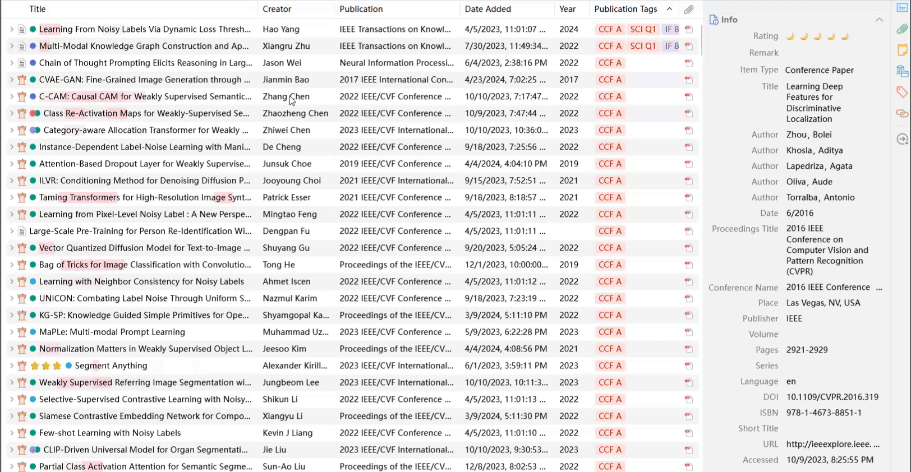
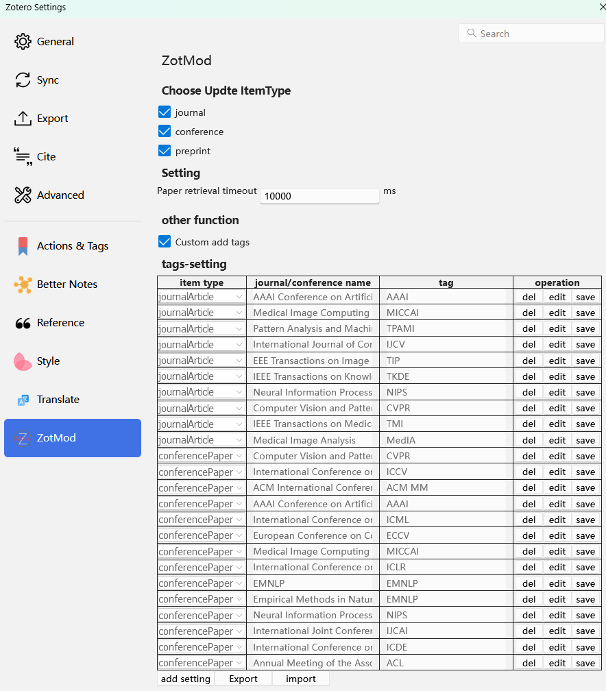

  

<!--  -->
<!--  -->

This README is also available in：[:cn: 简体中文](./doc/README-zh.md) | :gb: English

This is a [Zotero](https://www.zotero.org/) plugin that updates the metadata of the item, as well as a few additional small features.

 

## Catalogue
1. [Function](#Function)
	* 1.1. [Update DOI](#UpdateDOI)
	* 1.2. [Update Metadata](#UpdateMetadata)
	* 1.3. [Add Tag](#AddTag)
		* 1.3.1. [ Automatically add labels](#Automaticallyaddlabels)
		* 1.3.2. [ Manual addition](#Manualaddition)
2. [ PreferencePane](#PreferencePane)
	* 2.1. [ Choose Updte ItemType](#Chooseupdteitemtype)
	* 2.2. [ Settings](#Settings)
	* 2.3. [ Other functions](#Otherfunctions)
		* 2.3.1. [ Custom add tags](#Customaddtags)
3. [Install](#Install)
4. [Licence](#Licence)
5. [Alternatives](#Alternatives)
	* 5.1. [Update Metadata](#UpdateMetadata-1)
6. [Acknowledgements](#Acknowledgements)

##  1. Function

###  1.1. Update DOI
Gets and updates the DOI of the item.

###  1.2. Update Metadata
Update the metadata information for the item.

**Note:** Metadata is obtained through Zotero's DOI-based metadata scraping feature. Therefore, the amount of metadata crawled depends on Zotero's metadata crawled capabilities.
- When an item has a DOI, it is crawled directly by the DOI.
- If an item does not have a DOI, the DOI of the item is obtained according to its title, and then the item is crawled.
- When the item is Arxiv, regardless of whether the item has a DOI, the corresponding DOI is obtained according to the item title and then crawled.
###  1.3. Add Tag
####  1.3.1.  Automatically add labels
According to the configuration in the Settings panel, when a new journal is added, the corresponding label is automatically added.
####  1.3.2.  Manual addition
After updating the configuration in the Settings panel, when you want to add labels to the documents in the existing library.

##  2.  PreferencePane

###  2.1.  Choose Updte ItemType
Controls whether the selected item type belongs to the item type you want to update, preventing the item type you don't want to update when you click `Update Meta Data`. Currently, only three types of `journal/conference/preprint` are supported, and other types of entries have not been tested, so they have not been added.
###  2.2.  Settings
Control update metadata waiting time, more than this time indicates update failure `(recommended: 10000-20000)`, this is because the update is a single thread update, so it is not recommended to set too large.
###  2.3.  Other functions
In addition to features that update metadata, when you select additional features that you want to turn on, the corresponding features are turned on. Currently available are: `Custom add tags`

####  2.3.1.  Custom add tags
When you choose to use this feature, `tag-Setting` will appear below, click `add-setting`, fill in the appropriate information (item type, journal/conference name, tag (tag to be added)) and save. When a new entry is added, if the entry type matches and the journal/conference name appears in the journal/conference name of the new entry (it does not need to be exactly the same, just ensure that the configured journal/conference name is a substring of the journal/conference name of the new entry), then the corresponding tag is automatically added.
##  3. Install

1. Go to the [release page](https://github.com/dklsgui/zotMod/releases/)  to download [the latest `.xpi` file](https://github.com/dklsgui/zotMod/releases/latest/download/zotMod.xpi).
2. Then, in Zotero, click `Tools` -> `Add-ons`,and drag the `.xpi` onto the Add-ons window. See [how to install a Zotero addon](https://zotero-chinese.com/user-guide/plugins/about-plugin.html)。

**Note:** The latest version only supports Zotero 7, so you won't be able to use this plugin if you're using Zotero 6.

##  4. Licence

GNU Affero General Public License v3.0

##  5. Alternatives

###  5.1. Update Metadata
Both [zotero-format-metadata](https://github.com/northword/zotero-format-metadata) and [ZotMeta](https://github.com/RoadToDream/ZotMeta) plugins provide similar function.

##  6. Acknowledgements

The code of the following plug-ins was referenced during the development of this plug-in:

- [northword/zotero-format-metadata](https://github.com/northword/zotero-format-metadata)
- [RoadToDream/ZotMeta](https://github.com/RoadToDream/ZotMeta)
- [windingwind/zotero-actions-tags](https://github.com/windingwind/zotero-actions-tags)
