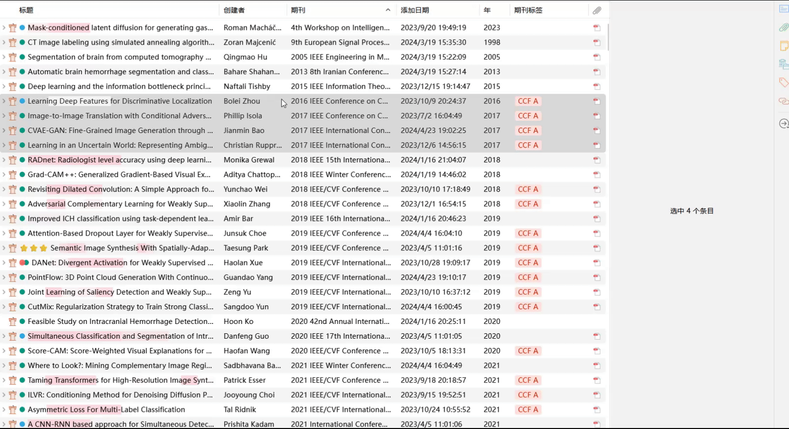
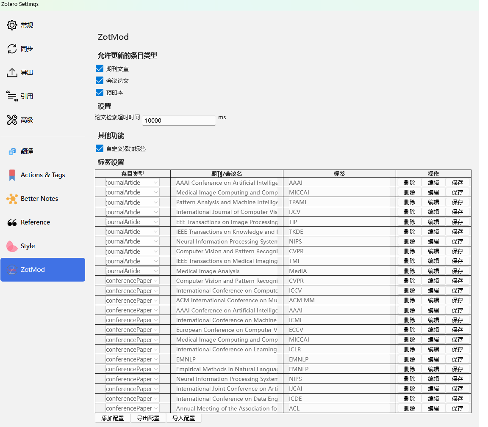

  

本 README 还适用于以下语言：:cn: 简体中文 | [:gb: English](../README.md)

这是一个 [Zotero](https://www.zotero.org/) 插件，可用于更新条目的元数据，以及一些额外的小功能。

 

## 目录

1. [功能](#)
	* 1.1. [更新DOI](#DOI)
	* 1.2. [更新元数据](#-1)
	* 1.3. [添加标签](#-1)
		* 1.3.1. [自动添加标签](#-1)
		* 1.3.2. [手动添加](#-1)
2. [设置面板](#-1)
	* 2.1. [允许更新的条目类型](#-1)
	* 2.2. [设置](#-1)
	* 2.3. [其他功能](#-1)
		* 2.3.1. [自定义添加标签](#-1)
3. [安装](#-1)
4. [Contribution](#Contribution)
5. [开源协议](#-1)
6. [替代品](#-1)
	* 6.1. [更新元数据](#-1)
7. [致谢](#-1)

##  1. 功能

###  1.1. 更新DOI
获取并更新条目的DOI

###  1.2. 更新元数据
更新条目的元数据信息

**注:** 元数据是通过 Zotero 的基于DOI的元数据抓取功能进行获取的。因此，元数据抓取的多少取决于 Zotero 的元数据抓取功能。
- 当条目有DOI时，会直接根据DOI进行抓取。
- 当条目没有DOI时，会根据条目的标题获取对应的DOI，然后再进行抓取。
- 当条目是Arxiv时，不管条目是否有DOI，都会根据条目的标题获取对应的DOI，然后再进行抓取。
###  1.3. 添加标签
####  1.3.1. 自动添加标签
根据在设置面板中的配置，当添加新的期刊时，会自动添加相应标签。
####  1.3.2. 手动添加
当更新了设置面板中的配置之后，想要为现有文献库中的文献添加标签时，可以进行以下操作：`点击鼠标邮件`->`点击添加标签`。

##  2. 设置面板

###  2.1. 允许更新的条目类型
控制选择的条目类型是否属于想要更新的条目类型，防止在点击 `更新元数据`时把不想更新的条目类型更新了。目前只支持`期刊/会议/预印本`三种类型，其他类型的条目没有进行相关测试，故没有添加。
###  2.2. 设置
控制更新元数据的等待时间，超过这个时间表示更新失败`(推荐：10000-20000)`，这是由于更新是单线程更新，所以不建议设置太大。
###  2.3. 其他功能
除了更新元数据之外的功能，当选择想要开启的额外功能时，会开启相应的功能。目前提供有：`自定义添加标签`

####  2.3.1. 自定义添加标签
当选择使用这个功能时，下方会出现`标签设置`，点击`添加配置`，填入相应的信息(条目类型，期刊/会议名，标签(要添加的标签))并保存。当加入新的条目时，如果条目类型能够匹配并且期刊/会议名在新条目的期刊/会议名中出现(不需要完全一样，只需要保证配置的期刊/会议名是新条目的期刊/会议名的子串即可)，那么就会自动添加相应的标签。
##  3. 安装

1. 前往 [发布页](https://github.com/dklsgui/zotMod/releases/) 下载 [最新的 `.xpi` 文件](https://github.com/dklsgui/zotMod/releases/latest/download/zotMod.xpi).
   <!-- - 如果你无法顺利的访问 GitHub，可以前往以下几个镜像站下载本插件。
     - [GitHub Proxy](https://ghproxy.com/?q=https://github.com/dklsgui/zotMod/releases/latest/download/zotMod.xpi)
     - [Zotero 插件镜像下载 - Zotero 中文社区](https://plugins.zotero-chinese.com/)
   - 如果你使用 FireFox ，请在 XPI 文件的链接上右击，选择“另存为...”。 -->
2. 在 Zotero 中，点击菜单 `工具` -> `附加组件`，将下载的 `.xpi` 文件拖入 Zotero 插件管理器页面。参阅 [如何安装 Zotero 插件](https://zotero-chinese.com/user-guide/plugins/about-plugin.html)。

注意：最新版本仅支持 Zotero 7，如果您正在使用 Zotero 6将无法使用该插件。

<!-- ## Todo

参阅 [Project #1](https://github.com/users/northword/projects/1)。 -->
<!-- 
##  4. Contribution

参阅 [贡献指南](./CONTRIBUTING.md). -->

##  5. 开源协议

GNU Affero General Public License v3.0

##  6. 替代品

###  6.1. 更新元数据
[zotero-format-metadata](https://github.com/northword/zotero-format-metadata) 和 [ZotMeta](https://github.com/RoadToDream/ZotMeta) 插件也都提供了类似的功能。

##  7. 致谢

插件开发过程中参考了如下项目的代码：

- [northword/zotero-format-metadata](https://github.com/northword/zotero-format-metadata)
- [RoadToDream/ZotMeta](https://github.com/RoadToDream/ZotMeta)
- [windingwind/zotero-actions-tags](https://github.com/windingwind/zotero-actions-tags)
